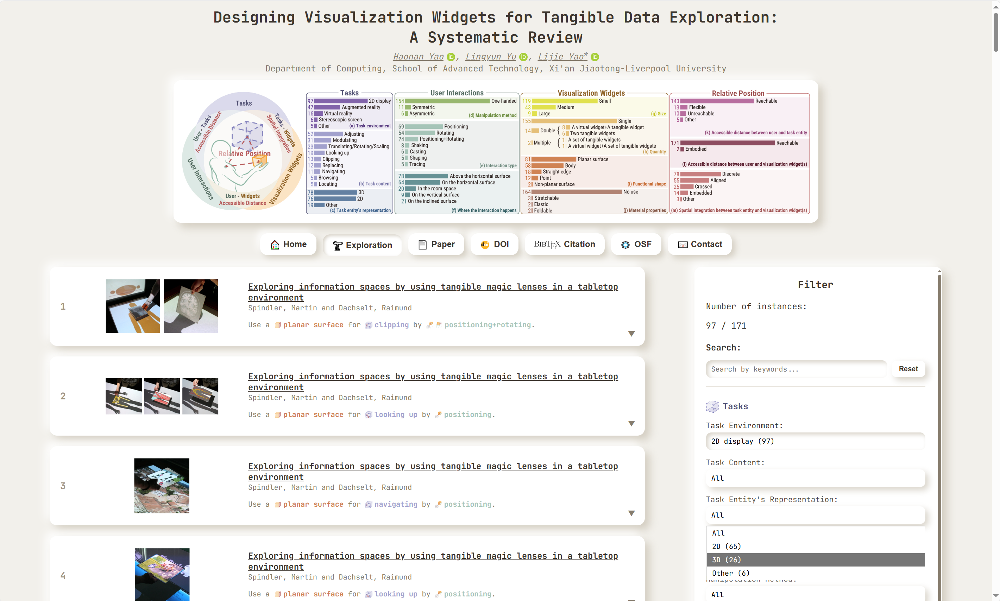
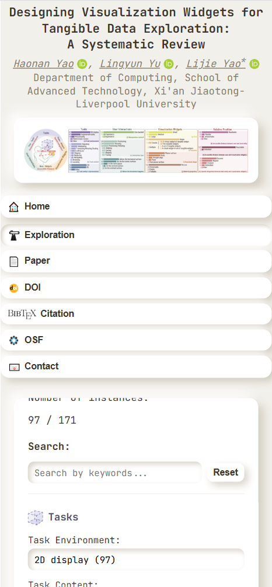

# Designing Visualization Widgets for Tangible Data Exploration: A Systematic Review

This repository contains the source code for an interactive website showcasing our systematic review results, provided in the paper ["Designing Visualization Widgets for Tangible Data Exploration: A Systematic Review"](
https://doi.org/10.48550/arXiv.2507.00775), published in [2025 IEEE Visualization Conference (VIS)](https://ieeevis.org/year/2025/welcome).
Our interactive website allows users to explore 171 instances obtained from our systematic review by filtering based on our proposed categorization. It is available online at https://physicalviswidget.github.io/.

If you use our interactive website and our results on **Designing Visualization Widgets for Tangible Data Exploration: A Systematic Review** in new projects or use it in a different way, we would appreciate a citation:

* Haonan Yao, Lingyun Yu, Lijie Yao. Designing Visualization Widgets for Tangible Data Exploration: A Systematic Review. To appear in 2025 IEEE Visualization and Visual Analytics (VIS). doi: [10.48550/arXiv.2507.00775](
https://doi.org/10.48550/arXiv.2507.00775).

    ```
    @INPROCEEDINGS{Yao:2025:VisWidgets,
        author={Yao, Haonan and Yu, Lingyun and Yao, Lijie},
        booktitle={2025 IEEE Visualization Conference (VIS)}, 
        title={Designing Visualization Widgets for Tangible Data Exploration: A Systematic Review}, 
        year={2025},
        volume={},
        number={},
        pages={},
        keywords={Visualization widget;Tangible interaction;Data exploration},
        note={early access},
        doi={10.48550/arXiv.2507.00775}
    }
    ```

## Getting started

To begin, either clone this repository or if you stay within GitHub, use the ''use this template'' function to generate your own version of this repository from which you can then edit. You will see the project hierarchy as follows:

```
└── Main directory
    ├── Resources
    ├── README.md
    └── index.html
```

Next, you can now test the website locally or explore it online. 
* If you prefer to use the online version, please open the page:
    ```
    https://physicalviswidget.github.io
    ```
    in your browser.

* Locally, you can use a development environment such as Python to serve the interactive website and to test whether it works as it should. If you use Python, run the command 
    ```
    python -m http.server 8080 
    ```
    in the terminal at the level at which you can find this README.md file to start the server and open the page:
    ```
    http://localhost:8080
    ```
    in your browser (Please check if YOUR PORT NUMBER is 8080 or not. If not, replace 8080 by **YOUR PORT NUMBER**).

Now, you should be able to access and use our interactive website to select conditions from categorization or enter paper information to filter results from our systematic review. 
<div style="display: flex; gap: 20px; margin-bottom: 20px; text-align: center;">
    <div style="flex: 0.7;">
        <li>An example image of PC interfaces:</li>
        
    </div>
    <div style="flex: 0.5;">
        <li>An example image of mobile interfaces:</li>
        
    </div>
</div>

## Updating in progress
This repository will be updated upon the official publication of the paper in the IEEE VIS 2025 proceedings. Stay tuned for the final version.
